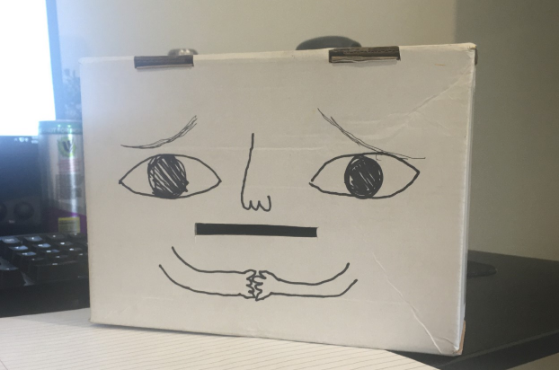
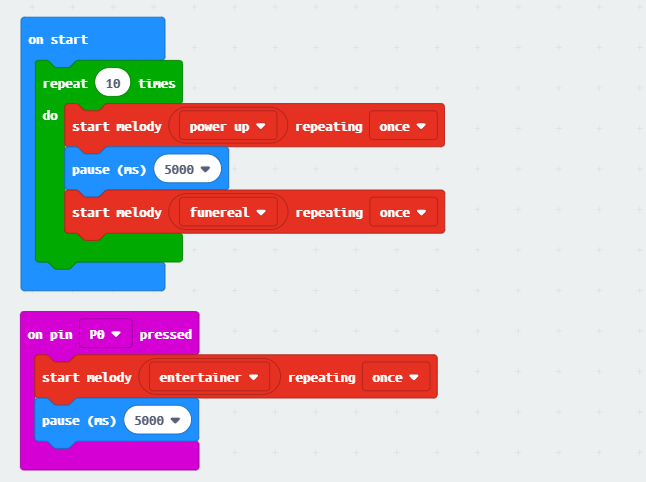
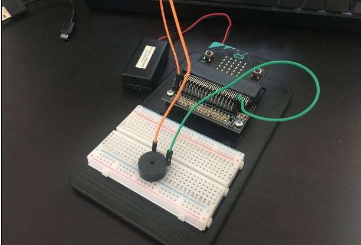

# 1701QCA Making Interaction - Assessment 2 workbook

## Project working title ##
NagBot 3000

## Related projects ##
### Related project 1 ###
Microbit: My robot asks me for money 

https://www.youtube.com/watch?v=Jskg6gfSGd8

I found this video while researching for Assessment 1 and it was an inspiration for my project. It's a robot with a simple function made possible by the micro:bit. A small detail I liked was the sound of the coin container slapping back on the table after storing the coins - it unintentially gives the robot character. 

### Related project 2 ###
Micro:bit milk jar robot

https://youtu.be/Ah4fEbJtklU

Similarly to the first related project, it's another cute robot friend. Seeing this project made me consider putting movement in my project, but it did definitely give me ideas on how to give my coinbank some personality. 

### Related project 3 ###
Interactive Animal Coin Bank

https://www.youtube.com/watch?v=qJ--GDy52ns

A popular interactive toy that has a simple sensor to detect the weight of the coin, and then a character that grabs the coin. Video attached shows the mechanisms inside. 

### Related project 4 ###
Fish Bank 

https://www.youtube.com/watch?v=qVyXm434qMU

An interactive coin bank by Moose toys. I don't think this product was a huge success but it caught my eye when I was young. When a coin is inserted, a sequence of animation appears on the screen. Counts the money inserted in the bank and has various other interactive options. 

### Related project 5 ###
Fisher-Price Laugh & Learn: Learning Piggy Bank

https://www.fisher-price.com/en-us/product/laugh-learn-smart-stages-piggy-bank-cdg67

An interactive coin bank toy by Fisher Price. 

## Other research ##
I've had a look into what I could use to implement the motion sensing for this project. I have a ultrasonic sensor lying around but I don't think that'll do the job. After some research into other projects I found a Arduino Compatible PIR Motion Detector Module (https://www.jaycar.com.au/arduino-compatible-pir-motion-detector-module/p/XC4444), but after having spoken to a Jaycar Representative they've let me know that I'd need a T-Adaptor shield. Because of self isolating as well, I've decided against this and I had the idea of implementing a similar design inspired by my timing gates project. 

By using cardboard and aluminium foil to detect the movement of the coin as it enters through the slot, I can get the micro:bit to play a sequence of tunes when this event occurs. 

## Conceptual progress ##

### Design intent ###
A device that displays emotion until a certain action is complete. 

### Design concept 2 ###

### Design concept 3 ###

### Final design concept ###
Original few designs for concept 1:

Final design 1:

### Interaction flowchart ###

## Physical experimentation documentation ##
I began by making a quick mockup of the device so I could have something tangible to play with.

I began coding simply and am currently experimenting.

## Design process discussion ##
For this project I wanted to create a simple robot 'friend' with a quirk. It's not an unique innovative concept or design, it's really just for fun and a bit of novelty. I spent a lot of time researching and looking into similar designs, and to see what sort of functions I could and couldn't get to work with the micro:bit. If this project was using Arduino I think I'd be able to do a bit more with adding sensors in this timeframe, but with the current situation and the micro:bit it's really just playing around and seeing what's going to work best and what isn't. 

## Next steps ##
I've still got to: 
- create a prototype 
- attach an external button
- finish the code
- trials
