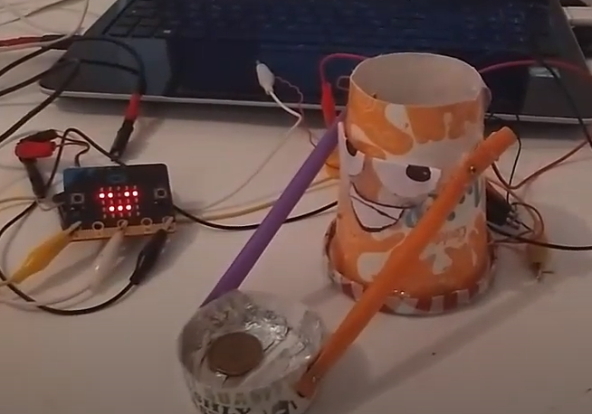
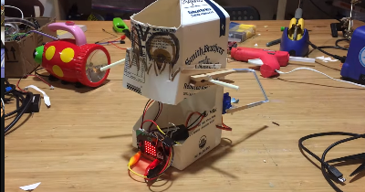
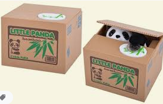
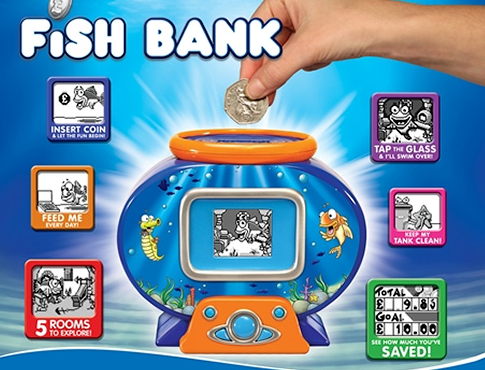
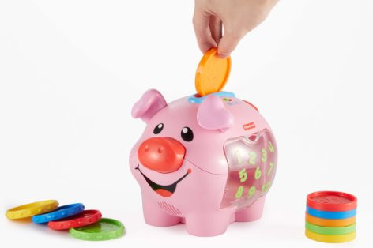
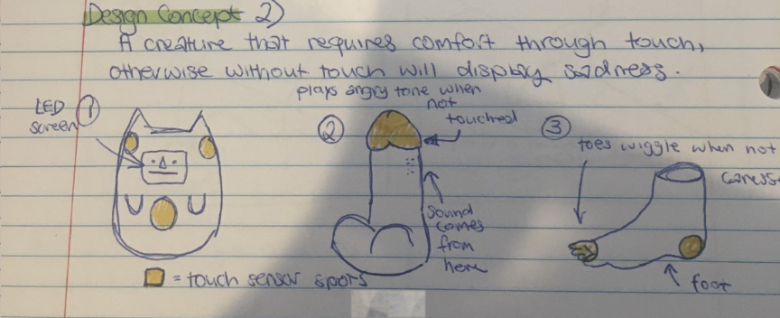
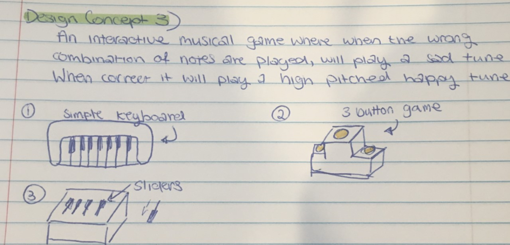
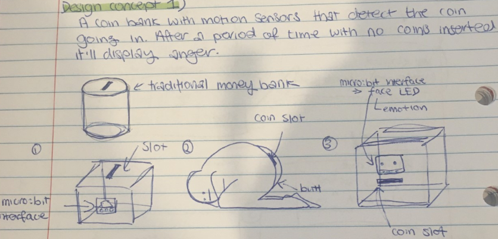
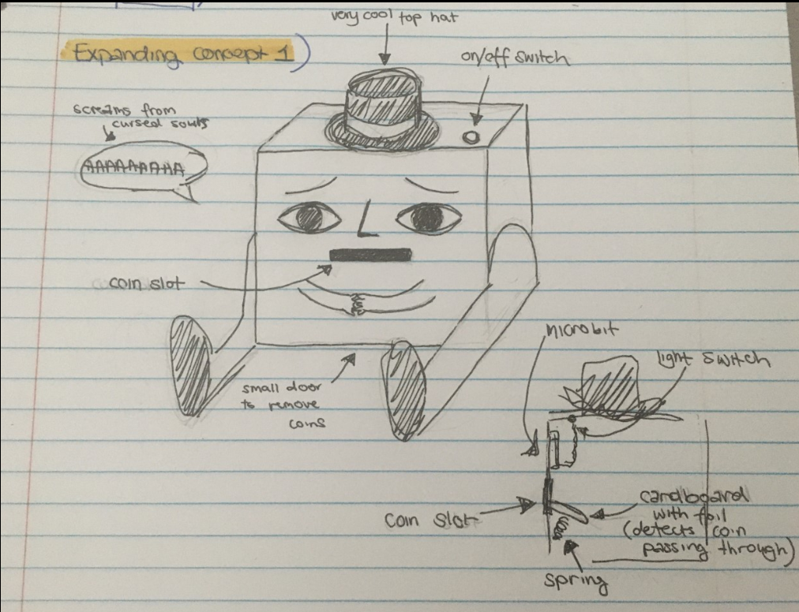
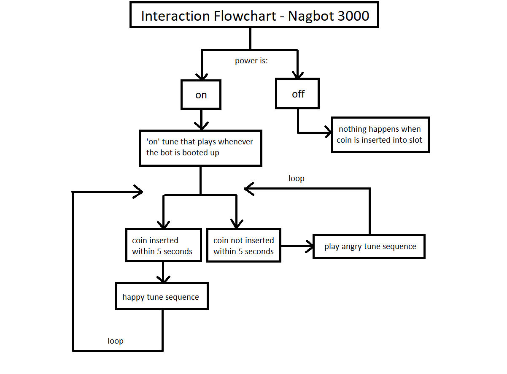

# 1701QCA Making Interaction - Assessment 2 workbook

## Project working title ##
NagBot 3000

## Related projects ##
### Related project 1 ###
Microbit: My robot asks me for money 

https://www.youtube.com/watch?v=Jskg6gfSGd8

I found this video while researching for Assessment 1 and it was an inspiration for my project. It's a robot with a simple function made possible by the micro:bit. A small detail I liked was the sound of the coin container slapping back on the table after storing the coins - it unintentially gives the robot character. 

### Related project 2 ###
Micro:bit milk jar robot

https://youtu.be/Ah4fEbJtklU

Similarly to the first related project, it's another cute robot friend. Seeing this project made me consider putting movement in my project, but it did definitely give me ideas on how to give my coinbank some personality. 

### Related project 3 ###
Interactive Animal Coin Bank

https://www.youtube.com/watch?v=qJ--GDy52ns

A popular interactive toy that has a simple sensor to detect the weight of the coin, and then a character that grabs the coin. Video attached shows the mechanisms inside. 

### Related project 4 ###
Fish Bank 

https://www.youtube.com/watch?v=qVyXm434qMU

An interactive coin bank by Moose toys. I don't think this product was a huge success but it caught my eye when I was young. When a coin is inserted, a sequence of animation appears on the screen. Counts the money inserted in the bank and has various other interactive options. 

### Related project 5 ###
Fisher-Price Laugh & Learn: Learning Piggy Bank

https://www.fisher-price.com/en-us/product/laugh-learn-smart-stages-piggy-bank-cdg67

An interactive coin bank toy by Fisher Price. 

## Other research ##
I've had a look into what I could use to implement the motion sensing for this project. I have a ultrasonic sensor lying around but I don't think that'll do the job. After some research into other projects I found a Arduino Compatible PIR Motion Detector Module (https://www.jaycar.com.au/arduino-compatible-pir-motion-detector-module/p/XC4444), but after having spoken to a Jaycar Representative they've let me know that I'd need a T-Adaptor shield. Because of self isolating as well, I've decided against this and I had the idea of implementing a similar design inspired by my timing gates project. 

By using cardboard and aluminium foil to detect the movement of the coin as it enters through the slot, I can get the micro:bit to play a sequence of tunes when this event occurs. 
### *Brief resource name/description* ###

*Provide a link, reference, or whatever is required for somebody else to find the resource. Then provide a few comments about what you have drawn from the resource.*

## Conceptual progress ##

### Design intent ###
A device that displays emotion until a certain action is complete. 

### Design concept 2 ###

### Design concept 3 ###

### Final design concept ###
Original few designs for concept 1:

Final design 1:

### Interaction flowchart ###

## Physical experimentation documentation ##

*In this section, show your progress including whichever of the following are appropriate for your project at this point.
a.	Technical development. Could be code screenshots, pictures of electronics and hardware testing, video of tests. 
b.	Fabrication. Physical models, rough prototypes, sketches, diagrams of form, material considerations, mood boards, etc.
Ensure you include comments about the choices you've made along the way.*

*You will probably have a range of images and screenshots. Any test videos should be uploaded to YouTube or other publicly accessible site and a link provided here.*

## Design process discussion ##
*Discuss your process in getting to this point, particularly with reference to aspects of the Double Diamond design methodology or other relevant design process.*

## Next steps ##
*Write a list or provide other information about your plan to move the project forward to be ready to present by video and documentation in week 12 of the course.*
